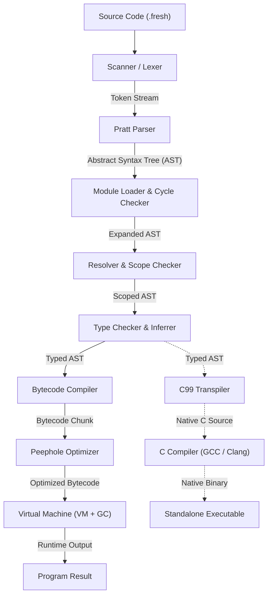

# ⚡ The Fresh Programming Language

<p align="center">
  
</p>

<p align="center">
  <b>A modern, statically-typed compiled language featuring a Pratt parser, optimizing bytecode compiler, stack-based Virtual Machine with mark-and-sweep GC, native C transpilation, closures, pattern matching, and developer tooling.</b>
</p>

<p align="center">
  <a href="https://pypi.org/project/fresh-lang/"></a>
  
  
  
  
</p>

---

## 📑 Table of Contents

- [🚀 Quickstart & Installation](#-quickstart--installation)
- [🌟 Key Highlights & Language Design](#-key-highlights--language-design)
- [🏗 Architecture & Compiler Pipeline](#-architecture--compiler-pipeline)
- [💻 Command-Line Interface (CLI)](#-command-line-interface-cli)
- [🛠 VS Code Integration & 1-Click Execution](#-vs-code-integration--1-click-execution)
- [🧩 Feature Showcase & Code Examples](#-feature-showcase--code-examples)
- [📂 Project Directory Structure](#-project-directory-structure)
- [📚 Documentation Index](#-documentation-index)
- [🧪 Running the Test Suite](#-running-the-test-suite)
- [📄 License](#-license)

---

## 🚀 Quickstart & Installation

### Option 1: Install from PyPI (Recommended)

Anyone on **Windows, macOS, or Linux** can install Fresh globally with one command:

```bash
pip install fresh-lang
```

### Option 2: Clone from GitHub

```bash
git clone https://github.com/CodeClosed/fresh-lang.git
cd fresh-lang
python -m pip install -e .
```

---

### 2. Write Your First Fresh Program

Create a file named `hello.fresh`:

```fresh
// hello.fresh
fn greet(name: string) -> string {
    return "Hello, " + name + "! Welcome to Fresh ⚡";
}

let message = greet("Developer");
println(message);
```

### 3. Run It!

```bash
# Direct CLI command
fresh run hello.fresh

# Universal Python module invocation (always works in any terminal)
python -m fresh run hello.fresh
```

**Output:**
```text
Hello, Developer! Welcome to Fresh ⚡
```

---

## 🛠️ Complete Project Workflow Walkthrough

Here is the exact step-by-step lifecycle for creating, running, formatting, and compiling a Fresh application:

### Step 1: Initialize a New Project
```bash
fresh init my_app
# or: python -m fresh init my_app
```
This generates the standard project structure:
```text
my_app/
├── fresh.toml             # Project manifest & configuration
├── src/
│   └── main.fresh         # Application entry point
└── tests/
    └── test_basic.fresh   # Initial test file
```

### Step 2: Run the Program (Bytecode VM)
Run your application immediately through the optimized Fresh bytecode VM:
```bash
fresh run my_app/src/main.fresh
# or: python -m fresh run my_app/src/main.fresh
```
**Output:**
```text
Hello from my_app!
```

### Step 3: Check Types & Syntax (Static Analysis)
Verify syntax, symbol scopes, and static types without executing:
```bash
fresh check my_app/src/main.fresh
# or: python -m fresh check my_app/src/main.fresh
```
**Output:**
```text
Check passed for 'my_app/src/main.fresh'.
```

### Step 4: Auto-Format Source Code
Format files according to official Fresh style guidelines:
```bash
# In-place formatting:
fresh fmt my_app/src/main.fresh

# CI check (verifies formatting without modifying):
fresh fmt --check my_app/src/main.fresh
```

### Step 5: Compile to Standalone Native Binary (C Machine Code)
Transpile to C99 and compile with GCC/Clang/MSVC into a native binary:
```bash
fresh build my_app
# or: python -m fresh build my_app
```
**Output:**
```text
Build succeeded: 'my_app/build/my_app.exe'.
```

### Step 6: Execute the Native Binary
Run the zero-dependency compiled binary directly from your OS terminal:
```bash
# Windows:
.\my_app\build\my_app.exe

# Linux / macOS:
./my_app/build/my_app
```
**Output:**
```text
Hello from my_app!
```


---

## 🌟 Key Highlights & Language Design

Fresh merges the expressive readability of modern languages with the predictable performance of a bytecode VM and C native code generator:

- **Static Typing with Local Inference**: Strict compile-time type verification with automatic type inference on `let` bindings.
- **Top-Down Operator Precedence (Pratt Parser)**: Clean, robust expression parsing with exact precedence levels and recursion bounds.
- **Visual Rust-Style Diagnostics**: Clear underline markers and error codes (`[E1001]` to `[E4001]`) for syntax and type errors.
- **First-Class Closures & Upvalues**: Functions capture variables across scopes with state persistence.
- **Pattern Matching with Guards**: Powerful `match` expressions supporting values, wildcards (`_`), and conditional `if` guard clauses.
- **User-Defined Records & Structs**: Strongly typed struct records with in-place mutable fields.
- **Dynamic Arrays & Matrices**: Native `[T]` arrays with `push`, `pop`, `len`, and multi-dimensional indexing.
- **Mark-and-Sweep Garbage Collection**: Automatic memory management tracing stacks, upvalues, and globals with `FRESH_GC_STRESS=1` allocation mode.
- **Native C Transpiler**: Compiles Fresh code directly to readable C99 with 1:1 behavioral equivalence for native binary builds (`gcc`, `clang`, `msvc`).
- **Complete Developer Tooling**: Built-in formatter (`fresh fmt`), package manager (`fresh init`/`fresh build`), type checker (`fresh check`), and REPL (`fresh repl`).

---

## 🏗 Architecture & Compiler Pipeline

Fresh uses a unified multi-stage pipeline:



---

## 💻 Command-Line Interface (CLI)

The `fresh` CLI provides an all-in-one developer toolkit:

| Command | Usage | Description |
| :--- | :--- | :--- |
| **`fresh run <file>`** | `fresh run main.fresh` | Compiles and executes a Fresh script on the Bytecode VM. |
| **`fresh check <file>`** | `fresh check main.fresh` | Static analysis: checks types and resolves names without running. |
| **`fresh fmt <file>`** | `fresh fmt main.fresh [--check]` | Formats source files idempotently according to standard Fresh style. |
| **`fresh init <name>`** | `fresh init my_app` | Scaffolds a new project with directory structure and `fresh.toml`. |
| **`fresh build [dir]`** | `fresh build .` | Builds the project entrypoint into a standalone native executable. |
| **`fresh test [dir]`** | `fresh test tests/` | Runs the automated pytest test suite. |
| **`fresh repl`** | `fresh repl` | Starts an interactive Read-Eval-Print-Loop session. |

### Compiler Inspection Flags

Inspect intermediate representations at any phase of compilation:

```bash
# Print token stream produced by lexical analysis
fresh run main.fresh --dump-tokens

# Print formatted Abstract Syntax Tree
fresh run main.fresh --dump-ast

# Print disassembled bytecode instructions & constant pool
fresh run main.fresh --disassemble

# Transpile Fresh AST directly into standalone C99 source code
fresh run main.fresh --emit-c
```

---

## 🛠 VS Code Integration & 1-Click Execution

The workspace includes ready-to-use VS Code configurations:

1. **Press `F5`**: Runs the currently active `.fresh` file in the integrated terminal.
2. **Press `Ctrl + Shift + B`**: Executes the default build task (`Fresh: Run Active File`).
3. **Command Palette (`Ctrl + Shift + P` -> `Tasks: Run Task`)**:
   - `Fresh: Run Active File`
   - `Fresh: Type Check Active File`
   - `Fresh: Format Active File`
   - `Fresh: Run Test Suite`
4. **Syntax Highlighting & File Icons**: Included in [`vscode-extension/`](file:///c:/Users/vihaa/OneDrive/Desktop/NEW_LANG/vscode-extension/).

---

## 🧩 Feature Showcase & Code Examples

Explore ready-to-run examples in the [`examples/`](file:///c:/Users/vihaa/OneDrive/Desktop/NEW_LANG/examples/) directory:

| Example File | Key Concept Demonstrated |
| :--- | :--- |
| [`all_features.fresh`](file:///c:/Users/vihaa/OneDrive/Desktop/NEW_LANG/all_features.fresh) | **Complete Tour**: Primitives, closures, matrices, structs, pattern matching, stdlib, file I/O |
| [`01_fibonacci.fresh`](file:///c:/Users/vihaa/OneDrive/Desktop/NEW_LANG/examples/01_fibonacci.fresh) | Recursive function calls, conditional returns, arithmetic |
| [`02_matrix_multiply.fresh`](file:///c:/Users/vihaa/OneDrive/Desktop/NEW_LANG/examples/02_matrix_multiply.fresh) | 2D dynamic arrays, nested loops, matrix multiplication |
| [`03_quicksort.fresh`](file:///c:/Users/vihaa/OneDrive/Desktop/NEW_LANG/examples/03_quicksort.fresh) | In-place array mutation, indexing, partition algorithm |
| [`04_closure_counter.fresh`](file:///c:/Users/vihaa/OneDrive/Desktop/NEW_LANG/examples/04_closure_counter.fresh) | Lexical closures, upvalue mutation across multiple function calls |
| [`05_calculator.fresh`](file:///c:/Users/vihaa/OneDrive/Desktop/NEW_LANG/examples/05_calculator.fresh) | First-class functions, higher-order function dispatch |
| [`06_inventory.fresh`](file:///c:/Users/vihaa/OneDrive/Desktop/NEW_LANG/examples/06_inventory.fresh) | User-defined structs, field mutations, inventory calculations |
| [`07_stress_suite.fresh`](file:///c:/Users/vihaa/OneDrive/Desktop/NEW_LANG/examples/07_stress_suite.fresh) | End-to-end stress test across all core language features |
| [`08_aggressive_suite.fresh`](file:///c:/Users/vihaa/OneDrive/Desktop/NEW_LANG/examples/08_aggressive_suite.fresh) | Deep recursion (Ackermann), map/filter higher-order lambdas, pattern guards |

---

## 📂 Project Directory Structure

```text
NEW_LANG/
├── all_features.fresh         # Complete feature showcase script
├── LANGUAGE_GUIDE.md          # Comprehensive language tutorial and handbook
├── README.md                  # Main project documentation (this file)
├── pyproject.toml             # Python build metadata & tool configuration
├── docs/                      # In-depth architectural documentation
│   ├── README.md              # Documentation Hub and Reading Paths
│   ├── specification.md       # Normative EBNF grammar & language specification
│   ├── architecture.md        # Compiler, VM, and C transpiler internal architecture
│   ├── comparison.md          # Academic comparative analysis vs Python, C, Rust
│   ├── standard_library.md    # Standard library & built-ins API reference
│   ├── cli_and_tooling.md     # Unified CLI, fresh.toml, and VS Code manual
│   ├── release_and_packaging.md # PyPI packaging, standalone binaries & CI/CD
│   ├── compatibility.md       # SemVer guarantees & diagnostic error codes catalog
│   └── presentation_guide.md  # 15-minute live demo and presentation script
├── examples/                  # Official runnable example programs
├── src/fresh/                 # Fresh compiler & runtime core package
│   ├── analyzer/              # Semantic analysis (Resolver, Type Checker)
│   ├── codegen/               # Bytecode compiler, optimizer, and C transpiler
│   ├── common/                # Shared AST tokens, type definitions, error types
│   ├── lexer/                 # Scanner and token definitions
│   ├── parser/                # Pratt expression parser and statement AST
│   ├── stdlib/                # Built-in functions and math library
│   ├── vm/                    # Virtual machine, CallFrame, and Mark-and-Sweep GC
│   ├── cli.py                 # Command-line interface driver
│   ├── formatter.py           # Canonical source code formatter
│   ├── modules.py             # Multi-file module loader and cycle detector
│   ├── package.py             # Package manager (init & build)
│   └── pipeline.py            # Unified end-to-end execution pipeline
├── tests/                     # 97 automated tests across all subsystems
└── vscode-extension/          # Official VS Code syntax highlighter & icons
```

---

## 📚 Documentation Index

For in-depth guides, visit the [**Documentation Hub (`docs/README.md`)**](file:///c:/Users/vihaa/OneDrive/Desktop/NEW_LANG/docs/README.md) or jump directly to:

- 📘 [**Language Guide (`LANGUAGE_GUIDE.md`)**](file:///c:/Users/vihaa/OneDrive/Desktop/NEW_LANG/LANGUAGE_GUIDE.md): Complete language tutorial from variables to closures and pattern matching.
- 📖 [**Complete Syntax Handbook (`docs/syntax_handbook.md`)**](file:///c:/Users/vihaa/OneDrive/Desktop/NEW_LANG/docs/syntax_handbook.md): Full syntax catalog with runnable code for variables, functions, structs, arrays, match, and file I/O.
- 📐 [**Formal Specification (`docs/specification.md`)**](file:///c:/Users/vihaa/OneDrive/Desktop/NEW_LANG/docs/specification.md): EBNF grammar, typing rules, and operational semantics.
- 🏛 [**Architecture Guide (`docs/architecture.md`)**](file:///c:/Users/vihaa/OneDrive/Desktop/NEW_LANG/docs/architecture.md): Deep-dive into compiler internals, AST structures, and VM bytecode engine.
- 🔬 [**Comparative Analysis (`docs/comparison.md`)**](file:///c:/Users/vihaa/OneDrive/Desktop/NEW_LANG/docs/comparison.md): Architectural comparison against Python, C, Rust, and Lox.
- 📚 [**Standard Library (`docs/standard_library.md`)**](file:///c:/Users/vihaa/OneDrive/Desktop/NEW_LANG/docs/standard_library.md): Comprehensive API reference for all built-ins and math functions.
- 💻 [**CLI & Developer Tooling (`docs/cli_and_tooling.md`)**](file:///c:/Users/vihaa/OneDrive/Desktop/NEW_LANG/docs/cli_and_tooling.md): CLI commands, flags, `fresh.toml`, and VS Code extension.
- 📦 [**Release & Packaging (`docs/release_and_packaging.md`)**](file:///c:/Users/vihaa/OneDrive/Desktop/NEW_LANG/docs/release_and_packaging.md): PyPI packaging, standalone binary compilation, and CI/CD.
- 🛡 [**Compatibility & Diagnostics (`docs/compatibility.md`)**](file:///c:/Users/vihaa/OneDrive/Desktop/NEW_LANG/docs/compatibility.md): SemVer policy and diagnostic codes catalog (`[E1001]`–`[E5001]`).
- 🎓 [**Demonstration & Defense Guide (`docs/demonstration.md`)**](file:///c:/Users/vihaa/OneDrive/Desktop/NEW_LANG/docs/demonstration.md): Complete presentation guide covering install, build, run, dual modes, tokens, C code, and defense Q&A.
- 🎤 [**Presentation Guide (`docs/presentation_guide.md`)**](file:///c:/Users/vihaa/OneDrive/Desktop/NEW_LANG/docs/presentation_guide.md): 15-minute live demo script with step-by-step walkthrough.

---

## 🧪 Running the Test Suite

Run the full automated test suite containing unit, integration, differential, safety, and GC stress tests:

```bash
# Run all tests
pytest -v

# Run with test coverage report
pytest --cov=fresh --cov-report=term-missing
```

---

## 📄 License

Fresh is open-source software distributed under the terms of the **[MIT License](file:///c:/Users/vihaa/OneDrive/Desktop/NEW_LANG/LICENSE)**.
